# **FarmHub**

FarmHub is a simple GUI platform for hosting and organising buyer-seller interactions running on a local database. 


_Logo made using [this](https://www.logoly.pro/#/)._


## **Background**

* This was made by me for my UG Second Year (Third Semester) Java / DBMS mini project. 

* In this project I've made use of Java GUI library [_JavaFX_](https://docs.oracle.com/javafx/2/overview/jfxpub-overview.htm) and its corresponding XML-based declarative markup language [_FXML_](https://docs.oracle.com/javafx/2/get_started/fxml_tutorial.htm) for designing the UI. 
Along with this, I've also made use of CSS for styling the UI. 
The application logic is written entirely in Java.


## **Screenshots**

* Sign in and Sign up

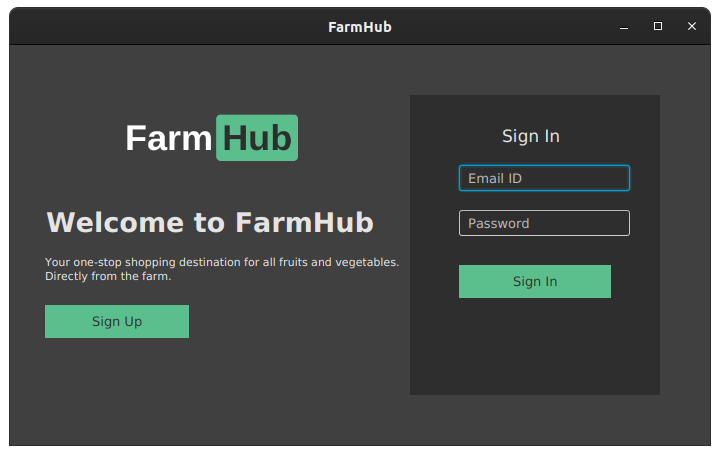
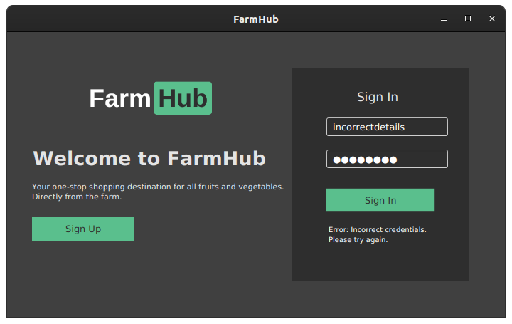
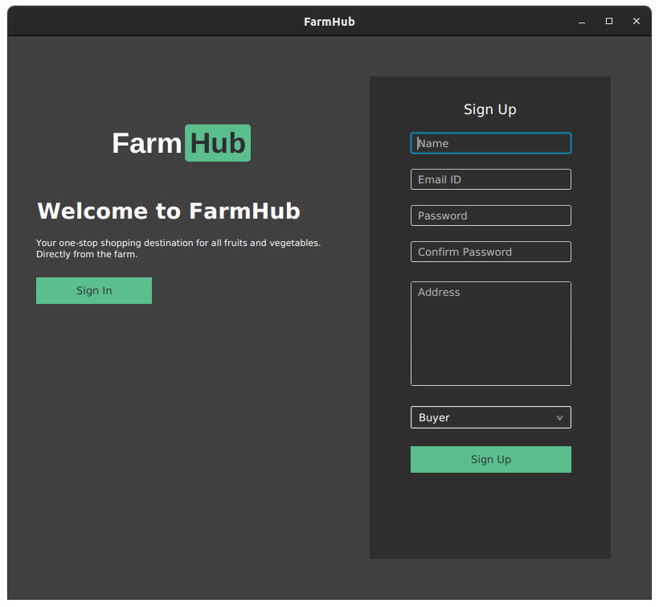

* Seller - Orders

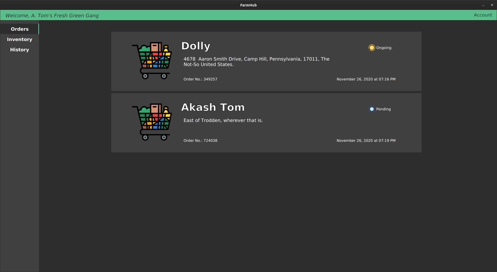
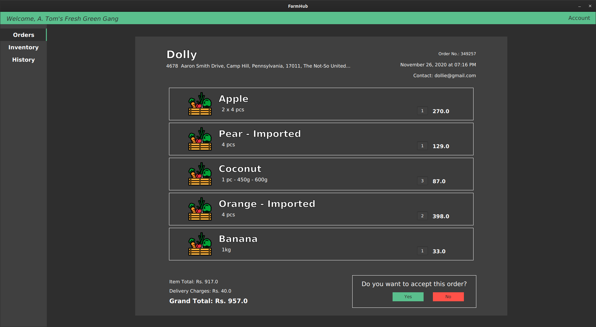
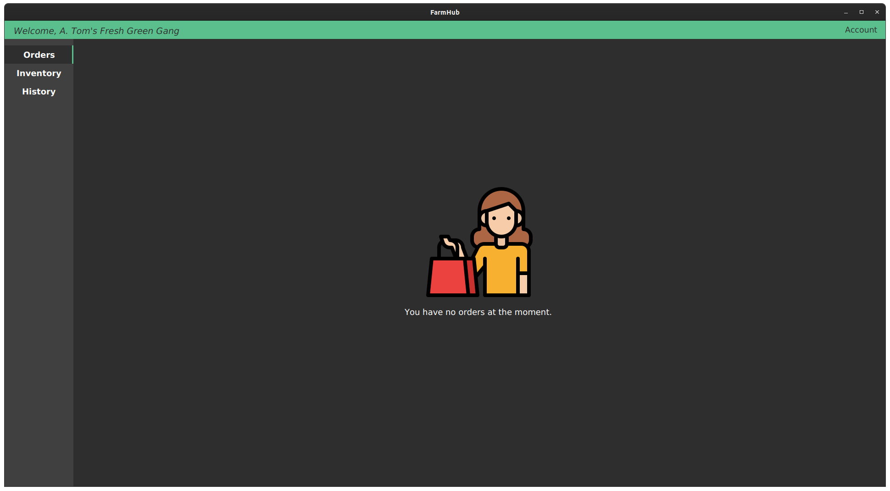

* Seller - Inventory

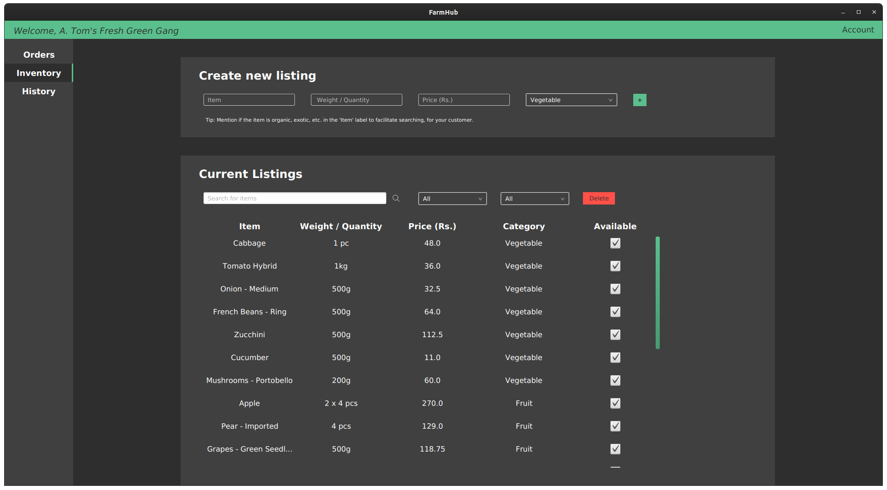

* Seller - History

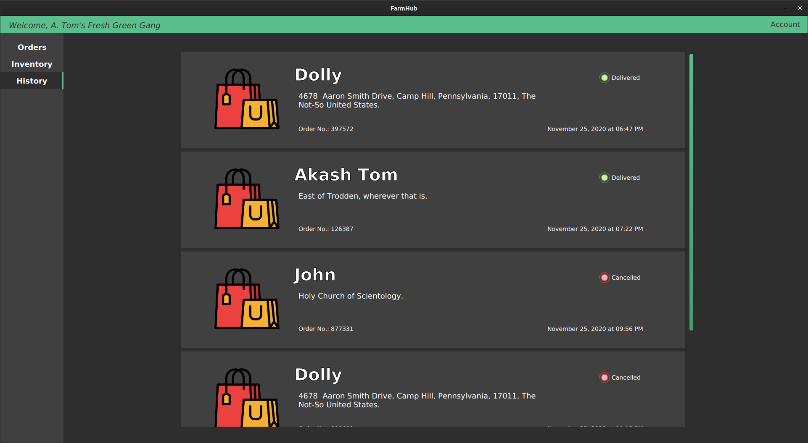
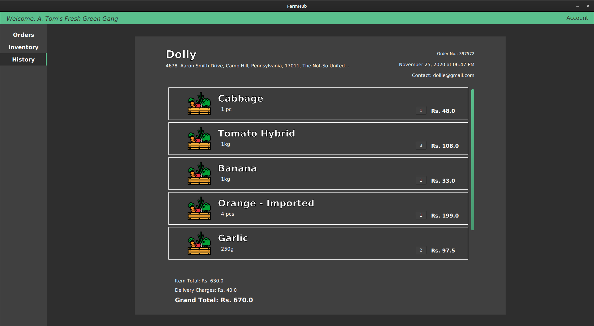

* Buyer - Viewing vendors

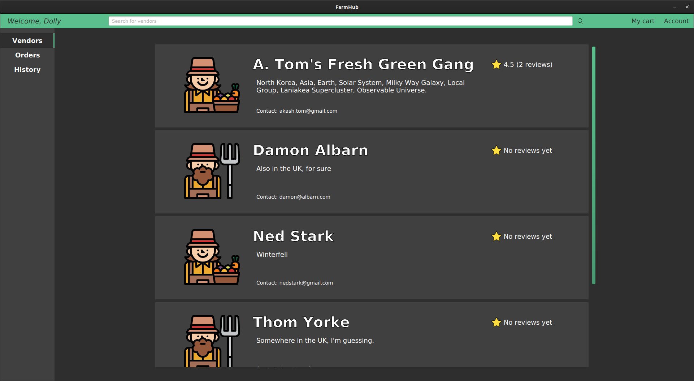
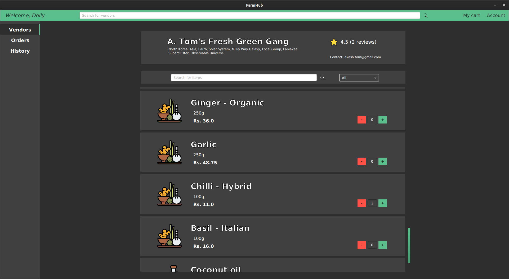
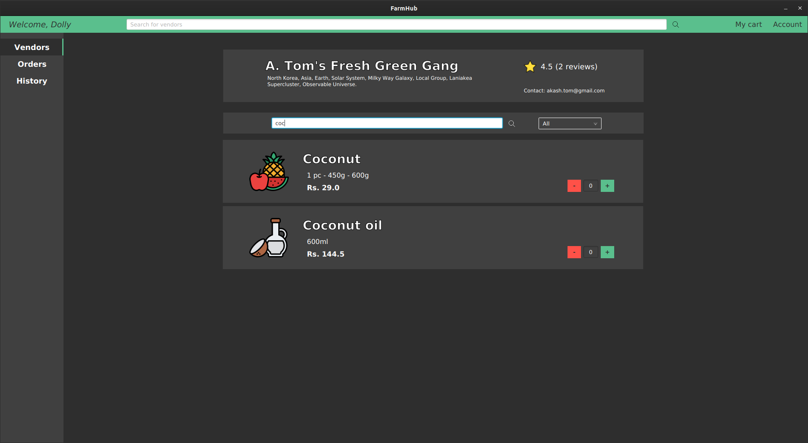

* Buyer - Cart

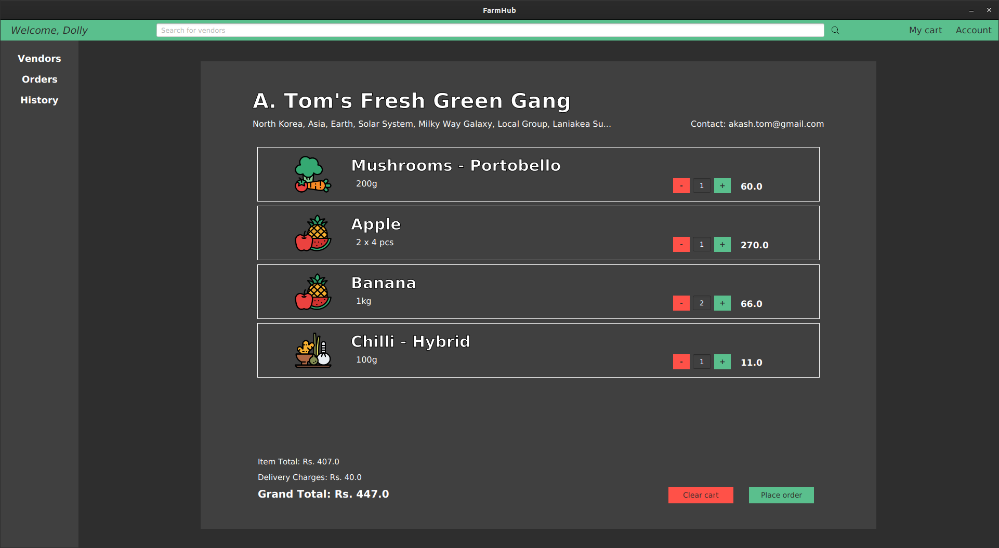
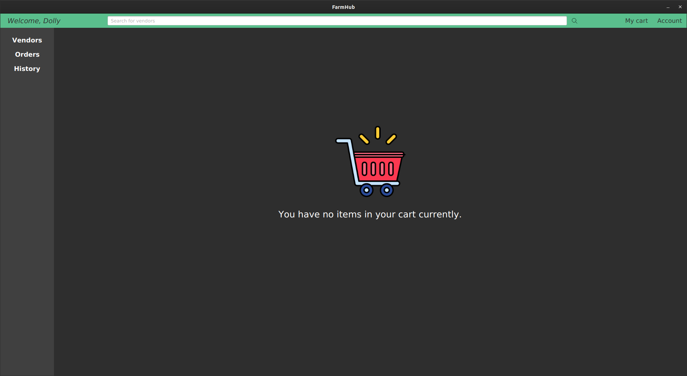

* Buyer - History

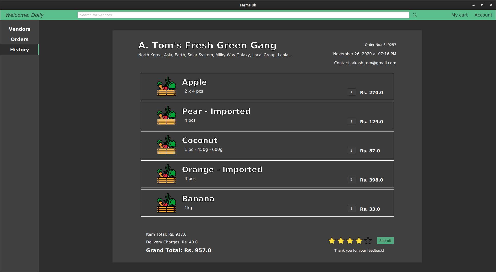

* Edit Profile

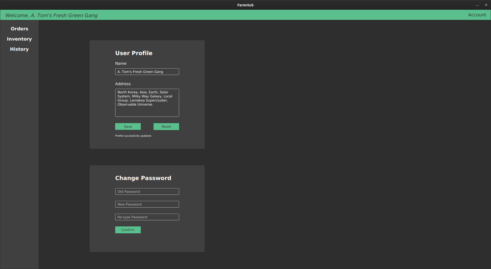

_Icons made by [Iconixar](https://www.flaticon.com/authors/iconixar)._


## **Database**

All database operation functions have been written in a single class ```UserDB.java```.

### I have made use of four tables under a single schema for this project.

* **Users**
    
    This is for storing all user details namely email, password, name, address and account type for both Buyers as well as Sellers. And for storing live status, rating and no. of reviews exclusively for Sellers.

    ```show create table users;```

    ```
    CREATE TABLE `users` (
    `type` varchar(7) NOT NULL,
    `name` varchar(40) NOT NULL,
    `email` varchar(64) NOT NULL,
    `password` varchar(40) NOT NULL,
    `address` varchar(300) NOT NULL,
    `live` tinyint(1) DEFAULT NULL,
    `rating` decimal(2,1) DEFAULT NULL,
    `reviews` int unsigned DEFAULT NULL,
    UNIQUE KEY `email` (`email`)
    )
    ```

* **Inventory**
    
    This is for storing the inventory of each Seller comprising of each item name, quantity, price, category and availability status.

    ```show create table inventory;```

    ```
    CREATE TABLE `inventory` (
    `seller` varchar(64) NOT NULL,
    `item` varchar(40) NOT NULL,
    `quantity` varchar(20) DEFAULT NULL,
    `price` double DEFAULT NULL,
    `category` varchar(30) DEFAULT NULL,
    `available` tinyint(1) DEFAULT NULL,
    KEY `seller` (`seller`),
    CONSTRAINT `inventory_ibfk_1` FOREIGN KEY (`seller`) REFERENCES `users` (`email`)
    )
    ```

* **Cart**
    
    This is for storing the cart of each Buyer comprising of each item name, quantity, price, category and number.

    ```show create table cart;```

    ```
    CREATE TABLE `cart` (
    `buyer` varchar(64) DEFAULT NULL,
    `seller` varchar(64) DEFAULT NULL,
    `item` varchar(64) NOT NULL,
    `quantity` varchar(20) NOT NULL,
    `price` double NOT NULL,
    `number` int unsigned NOT NULL DEFAULT '0',
    `category` varchar(30) DEFAULT NULL,
    KEY `buyer` (`buyer`),
    KEY `seller` (`seller`),
    CONSTRAINT `cart_ibfk_1` FOREIGN KEY (`buyer`) REFERENCES `users` (`email`),
    CONSTRAINT `cart_ibfk_2` FOREIGN KEY (`seller`) REFERENCES `users` (`email`)
    )
    ```

* **Orders**
    
    In addition to the details of each item in the aforementioned _cart_ table, this is for storing all orders involving the following details for each order: order no., Buyer, Seller, order date and time, order status and the rating given for each order. The order status involves "Pending", "Ongoing", "Delivered" and "Cancelled".

    ```show create table orders;```

    ```
    CREATE TABLE `orders` (
    `orderno` int DEFAULT NULL,
    `buyer` varchar(64) DEFAULT NULL,
    `seller` varchar(64) DEFAULT NULL,
    `item` varchar(64) DEFAULT NULL,
    `quantity` varchar(20) DEFAULT NULL,
    `price` double DEFAULT NULL,
    `num` int unsigned DEFAULT NULL,
    `orderdate` date DEFAULT NULL,
    `ordertime` time DEFAULT NULL,
    `stat` varchar(30) DEFAULT NULL,
    `stars` int DEFAULT NULL,
    KEY `buyer` (`buyer`),
    KEY `seller` (`seller`),
    CONSTRAINT `orders_ibfk_1` FOREIGN KEY (`buyer`) REFERENCES `users` (`email`),
    CONSTRAINT `orders_ibfk_2` FOREIGN KEY (`seller`) REFERENCES `users` (`email`)
    )
    ```

    
